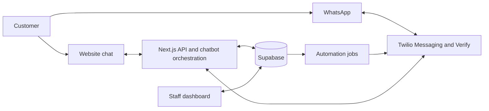

# Ton Mai Spa — Twilio Booking, CRM, Chatbot and Automation Plan

**Prepared:** 4 July 2026  
**Purpose:** Consolidated plan from the discussion beginning around 12:22 AM about using Twilio for chatbot booking, CRM, automation, staff handoff and cross-device customer memory.

## 1. Executive summary

Ton Mai Spa should keep its existing application as the operational centre:

- **Supabase** remains the source of truth for customers, conversations, bookings, therapists, rooms and availability.
- **The existing MiniMax chatbot** remains the conversational and recommendation layer.
- **The Next.js/Vercel application** remains the secure orchestration and staff dashboard layer.
- **Twilio** becomes the WhatsApp communication, verification and message-delivery layer.

Twilio should not own the booking calendar or be the only location where customer history is stored. Website chat, WhatsApp and staff responses should all write to one shared customer timeline in Supabase.

## 2. Target customer experience

A customer should be able to:

1. Start chatting anonymously on the Ton Mai Spa website.
2. Ask questions and receive treatment recommendations.
3. Check real therapist and room availability.
4. Prepare a booking without creating it prematurely.
5. Confirm the booking using a clear button or WhatsApp quick reply.
6. Switch from the bot to a staff member without repeating the conversation.
7. Move from mobile to computer, or from website chat to WhatsApp, after verifying their identity.
8. Receive confirmation, reminders, directions, rescheduling and cancellation assistance.
9. Return later and allow the bot to remember appropriate preferences and booking history.

## 3. Recommended architecture



### System responsibilities

| Component | Responsibility |
|---|---|
| Supabase | Customer identity, conversations, messages, booking records, CRM data and automation jobs |
| MiniMax chatbot | Natural-language understanding, recommendations and conversational replies |
| Next.js API | Security, tool execution, booking validation, handoff rules and Twilio integration |
| Twilio Programmable Messaging | Send and receive WhatsApp messages |
| Twilio Verify | Verify phone ownership when restoring history on another device |
| Twilio Content Templates | Approved reminders and messages outside WhatsApp's service window |
| Staff dashboard | Shared inbox, customer timeline, handoff, bookings and CRM actions |
| Twilio Studio | Optional simple workflows such as waiting for YES, timeouts and surveys |

## 4. Core design principle: one shared conversation

The bot and staff must read and write to the same conversation record.

The conversation should not exist only in browser local storage, inside Twilio or as a single opaque JSON history. Every message should be stored as a separate database record linked to a conversation and, after verification, a customer.

```text
Customer
├── Verified WhatsApp number
├── Mobile browser device
├── Computer browser device
├── Website conversation
├── WhatsApp conversation
├── Staff messages
└── Booking history
```

## 5. Proposed data model

### `customers`

Permanent CRM record.

- `id`
- `display_name`
- `primary_phone_e164`
- `email`
- `preferred_language`
- `whatsapp_consent_at`
- `marketing_consent_at`
- `opted_out_at`
- `last_contact_at`
- `last_visit_at`
- `visit_count`
- `lifetime_value`
- `created_at`
- `updated_at`

### `customer_identities`

Connects verified identifiers and devices to one customer.

- `id`
- `customer_id`
- `identity_type`: `whatsapp_phone`, `email`, `auth_user` or `browser_device`
- `canonical_value` or secure value hash
- `verified_at`
- `last_used_at`
- `revoked_at`

### `device_sessions`

Secure device-level sessions.

- `id`
- `customer_id`
- `device_token_hash`
- `expires_at`
- `last_seen_at`
- `revoked_at`

The raw device token should be stored only in a secure, HttpOnly cookie. Store only its hash in the database.

### `conversation_threads`

- `id`
- `customer_id`, nullable while anonymous
- `channel`: `web`, `whatsapp` or `mixed`
- `mode`: `bot`, `waiting_for_staff`, `human` or `closed`
- `assigned_staff_id`
- `last_inbound_at`
- `last_outbound_at`
- `service_window_expires_at`
- `created_at`
- `closed_at`

### `conversation_messages`

- `id`
- `thread_id`
- `sender_type`: `customer`, `bot`, `staff` or `system`
- `channel`
- `body`
- `twilio_message_sid`, unique when applicable
- `button_payload`
- `delivery_status`
- `delivery_error_code`
- `created_at`
- `delivered_at`
- `read_at`

### `conversation_summaries`

- `thread_id`
- `summary`
- `customer_intent`
- `treatment_interest`
- `preferred_date`
- `preferred_time`
- `booking_draft_id`
- `handoff_reason`
- `updated_at`

### `handoffs`

- `id`
- `thread_id`
- `reason`
- `priority`
- `status`: `waiting`, `accepted`, `resolved` or `abandoned`
- `assigned_staff_id`
- `requested_at`
- `accepted_at`
- `resolved_at`

### `automation_jobs`

- `id`
- `customer_id`
- `booking_id`
- `job_type`
- `scheduled_for`
- `status`: `pending`, `processing`, `sent`, `failed` or `cancelled`
- `attempt_count`
- `twilio_message_sid`
- `processed_at`
- `error_message`

Existing `bookings` and `chat_sessions` should gain a nullable `customer_id`. Existing data can be linked gradually after a customer verifies their phone number.

## 6. Website-to-staff handoff

### Handoff triggers

The bot should offer or initiate a staff handoff when:

- The customer explicitly requests a person.
- The bot has low confidence or lacks confirmed information.
- The customer has a complaint.
- The request involves medical suitability or sensitive health details.
- A discount, refund, exception or deliberate overbooking is requested.
- The booking is for a large group or has unusual requirements.
- Availability cannot be resolved safely.

### Handoff sequence

1. Store the latest customer message.
2. Generate a short factual conversation summary.
3. Set the thread mode to `waiting_for_staff`.
4. Create a `handoffs` record.
5. Notify available staff in the dashboard.
6. Display an estimated response message to the customer.
7. Staff opens the shared inbox and sees:
   - Full transcript
   - AI-generated summary
   - Customer details
   - Booking draft
   - Treatment and preferred time
   - Handoff reason
8. Staff clicks **Accept conversation**.
9. Set the thread mode to `human` and silence the bot.
10. Staff replies through the same website widget or through WhatsApp.
11. Staff selects **Return to bot** or **Close conversation** when finished.

The customer does not repeat anything because the staff member sees the same thread and summary.

## 7. Website-to-WhatsApp handoff

Previous website messages cannot automatically appear as old messages inside the customer's WhatsApp application. Instead:

1. Ask permission to continue on WhatsApp.
2. Verify or collect the customer's WhatsApp number.
3. Attach the web thread to the CRM customer.
4. Keep the full transcript visible to staff in the unified dashboard.
5. Send a contextual first message, for example:

> Hi Anna, this is Noi from Ton Mai Spa. I can see you were asking about Thai Oil Massage tomorrow at 3 PM. I can continue helping from here.

From the customer's perspective, the conversation continues naturally. From the staff perspective, the full website history remains available.

## 8. Cross-device customer memory

An anonymous browser cookie identifies a device, not a person. The system must not restore private history on another device merely because someone enters a matching name or phone number.

### Recommended customer flow

On mobile web, offer:

> Would you like me to remember this conversation so you can continue on another device?

If accepted:

1. Customer enters a WhatsApp number.
2. Twilio Verify sends a one-time code through WhatsApp.
3. Customer enters the code.
4. The anonymous conversation is attached to a permanent `customer_id`.
5. A secure remembered-device cookie is issued.

On a computer:

1. Customer selects **Continue previous conversation**.
2. Customer enters the WhatsApp number.
3. Twilio Verify sends another one-time code.
4. After successful verification, create a new secure device session.
5. Restore the active thread, summary and valid booking draft.
6. The bot replies with context:

> Welcome back, Anna. We were looking at Thai Oil Massage tomorrow at 3 PM. Would you like to continue?

### Memory levels

The bot should separate memory into:

1. **Session memory:** recent messages required for the current conversation.
2. **Conversation summary:** compact summary of previous discussions and unresolved actions.
3. **Customer memory:** verified name, language, preferences, visits and bookings.

Do not automatically retain sensitive medical information. Store only information needed to provide the service and only with appropriate consent.

## 9. WhatsApp chatbot booking workflow

1. Twilio receives an inbound WhatsApp message.
2. Twilio sends a webhook to `/api/twilio/whatsapp/inbound`.
3. The API validates `X-Twilio-Signature`.
4. Deduplicate using `MessageSid`.
5. Normalize the sender into E.164 format.
6. Resolve or create the CRM customer and active thread.
7. Store the inbound message.
8. Pass recent messages, the thread summary and relevant customer facts to the chatbot.
9. The chatbot may use existing tools to:
   - Recommend treatments
   - Check therapist and room availability
   - Prepare a booking draft
10. Send available times using WhatsApp quick-reply buttons.
11. Send a booking review with:
   - **Confirm**
   - **Change time**
   - **Cancel**
12. A Confirm payload calls the same secure server-side confirmation logic used by the website.
13. Recheck capacity immediately before insertion.
14. Insert one pending booking and clear the one-time draft.
15. Send the reference code and confirmation status.
16. Schedule reminder automation jobs.

Suggested quick-reply payloads:

```text
BOOKING_CONFIRM:<draft-token>
BOOKING_CHANGE:<draft-token>
BOOKING_CANCEL:<draft-token>
HANDOFF_REQUEST:<thread-id>
```

Payloads must be validated server-side. Never trust booking details received directly from a button payload.

## 10. Twilio API endpoints

### Inbound messaging

`POST /api/twilio/whatsapp/inbound`

- Validate Twilio signature.
- Parse form-encoded webhook fields.
- Deduplicate `MessageSid`.
- Store inbound message.
- Queue chatbot processing.
- Return a successful response quickly.

### Delivery status

`POST /api/twilio/whatsapp/status`

- Validate signature.
- Update `queued`, `sent`, `delivered`, `read`, `failed` or `undelivered` status.
- Store Twilio error codes.
- Do not assume callbacks always arrive in chronological order.

### Verification

- `POST /api/customer/verification/start`
- `POST /api/customer/verification/check`
- `POST /api/customer/device/logout`

### Staff messaging

`POST /api/admin/conversations/:id/messages`

- Require authenticated staff.
- Store the staff message.
- Send through the correct channel.
- Observe the WhatsApp service-window rules.

### Handoff management

- `POST /api/admin/conversations/:id/accept`
- `POST /api/admin/conversations/:id/return-to-bot`
- `POST /api/admin/conversations/:id/close`

### Scheduled automation

`POST /api/cron/process-automation-jobs`

- Protected by a cron secret.
- Lock jobs before sending.
- Retry transient failures safely.
- Never send a cancelled booking reminder.

## 11. WhatsApp templates

Outside WhatsApp's 24-hour customer-service window, business-initiated messages require approved templates. Prepare these utility templates early:

- `booking_received`
- `booking_confirmed`
- `booking_changed`
- `booking_cancelled`
- `appointment_reminder_24h`
- `appointment_reminder_2h`
- `staff_followup_requested`
- `post_visit_feedback`

Possible later marketing templates, used only with consent:

- `welcome_back_offer`
- `birthday_offer`
- `lapsed_customer_offer`

Prepare language variants for English and Thai first, then Russian and Chinese according to customer demand.

## 12. Automation opportunities

### Booking operations

- Immediate booking-received message
- Staff notification for new pending bookings
- Automatic confirmation message after staff confirms
- 24-hour reminder
- 2-hour reminder with Google Maps directions
- Confirm attendance button
- Reschedule request button
- Cancellation request button
- Notify staff about failed or unread critical messages

### CRM automation

- Create or update customer after verified contact
- Identify first-time versus returning customers
- Update visit count and lifetime value after completed bookings
- Track treatment preferences based on completed visits
- Apply tags such as `new`, `repeat`, `vip`, `lapsed` and `group_booking`
- Detect duplicate customer records for staff review
- Record acquisition source: web, WhatsApp, walk-in, phone or campaign

### Service automation

- Staff handoff for complaints or complex questions
- Alert when a waiting conversation exceeds the response target
- Follow up when a customer abandons a booking draft
- Post-treatment satisfaction survey
- Escalate negative feedback privately to the owner
- Request a public review only after a positive satisfaction response

### Marketing automation

- Re-engage lapsed customers
- Birthday or anniversary offers
- Promote quieter weekday periods
- Recommend related treatments based on completed booking history
- Segment campaigns by language and consent

Marketing campaigns, discounts and bulk sends should require owner approval.

## 13. Human-control rules

The chatbot must never autonomously:

- Deliberately overbook a therapist or room
- Promise a specific therapist without a capacity check
- Approve refunds or discounts
- Send bulk marketing campaigns
- Diagnose medical conditions
- Store sensitive health information without explicit need and consent
- Expose another customer's conversation after an unverified phone lookup

Staff approval is required for exceptions, complaints, medical suitability, refunds, discounts, large groups and high-risk situations.

## 14. Security and reliability

- Keep all Twilio credentials in Vercel environment variables.
- Never expose the Auth Token or API key secret to the browser.
- Use a restricted Twilio API key for outbound API calls.
- Retain the Auth Token server-side for webhook-signature validation.
- Validate every Twilio webhook using the official SDK and the exact public request URL.
- Support evolving webhook fields rather than hardcoding a small parameter list.
- Use a unique database constraint on `twilio_message_sid`.
- Make inbound processing and automation jobs idempotent.
- Recheck booking availability at confirmation time.
- Use one-time, expiring booking-draft tokens.
- Hash device-session tokens.
- Rate-limit verification, inbound chatbot and booking endpoints.
- Log security events without logging secrets or unnecessary personal data.
- Provide **Forget this device**, **Delete my history** and opt-out functions.
- Define a clear conversation and message retention policy consistent with PDPA obligations.

## 15. Twilio Studio recommendation

Do not put core availability, booking or CRM rules inside Twilio Studio. Those rules already belong in the Next.js application and Supabase.

Studio is useful for bounded deterministic flows such as:

- Send and wait for YES/NO
- Reminder timeout branches
- Simple satisfaction surveys
- No-reply follow-up
- Escalation to a staff notification

This avoids having booking logic split between two systems.

## 16. Staff dashboard additions

Add a **Conversations** section containing:

- Waiting, active and closed queues
- Unread count
- Channel indicator
- Customer name and verified status
- Latest message
- Waiting time
- Assigned staff member
- Full transcript
- AI summary
- Booking draft and upcoming bookings
- Customer history and tags
- Accept, reply, return-to-bot and close controls

Use Supabase Realtime so website customers receive staff messages without refreshing the page.

## 17. Recommended implementation phases

### Phase 1 — Twilio foundation

- Confirm WhatsApp sender is Sandbox or production-approved.
- Create restricted Twilio API credentials.
- Add environment variables.
- Build inbound webhook and signature validation.
- Build outbound message helper.
- Add message-status callback.
- Add message deduplication and audit logging.

### Phase 2 — Unified conversation storage

- Add customer, identity, thread, message, summary and handoff tables.
- Migrate website chat to row-per-message storage.
- Preserve current `chat_sessions` compatibility during migration.
- Build the staff shared inbox.

### Phase 3 — WhatsApp booking

- Connect WhatsApp messages to existing chatbot tools.
- Add availability quick replies.
- Add booking review and confirmation buttons.
- Reuse the existing server-side booking-confirmation service.
- Add reschedule and cancellation requests.

### Phase 4 — Staff handoff

- Add bot-to-human triggers.
- Add handoff queue and staff notifications.
- Silence bot while a human owns the thread.
- Add return-to-bot and close controls.

### Phase 5 — Cross-device identity

- Add Twilio Verify Service.
- Add WhatsApp OTP start/check endpoints.
- Add secure device sessions.
- Add **Remember this conversation** and **Continue previous conversation** UI.
- Add customer-data deletion and device logout.

### Phase 6 — Booking automation

- Add automation job scheduler.
- Submit utility templates for approval.
- Add booking confirmation, reminders and directions.
- Add delivery/read tracking and failure alerts.

### Phase 7 — CRM and controlled marketing

- Add customer timeline, tags and segmentation.
- Calculate visit count and lifetime value from completed bookings.
- Add satisfaction and review workflows.
- Add consent-controlled owner-approved campaigns.

## 18. Environment variables

Suggested server-side variables:

```text
TWILIO_ACCOUNT_SID=
TWILIO_API_KEY_SID=
TWILIO_API_KEY_SECRET=
TWILIO_AUTH_TOKEN=
TWILIO_MESSAGING_SERVICE_SID=
TWILIO_WHATSAPP_FROM=
TWILIO_VERIFY_SERVICE_SID=
TWILIO_STATUS_CALLBACK_URL=
CRON_SECRET=
```

Content Template SIDs may be stored as environment variables initially or in a protected settings table when staff need to manage them.

## 19. Acceptance criteria

The first production release is successful when:

- A WhatsApp customer can ask a question and receive a chatbot response.
- Twilio webhooks with invalid signatures are rejected.
- Duplicate webhooks do not create duplicate messages or bookings.
- The chatbot can check real availability.
- A booking is not inserted until the customer confirms.
- Confirmation creates exactly one pending booking.
- Staff can see the full web or WhatsApp transcript.
- Customer can request a human and continue without repetition.
- The bot remains silent while staff owns the conversation.
- A verified customer can resume on another device.
- An unverified phone entry cannot reveal conversation history.
- Reminders stop when a booking is cancelled.
- Delivery failures are visible to staff.
- Marketing sends require consent and owner approval.

## 20. Initial decisions required

Before implementation, confirm:

1. Is the Twilio WhatsApp sender still in Sandbox or approved for production?
2. Which languages should be supported in the first message-template submission?
3. What hours will staff actively answer live handoffs?
4. What is the target response time for a waiting customer?
5. Should customers be allowed to cancel automatically, or should cancellation create a staff request?
6. How long should conversation messages and customer profiles be retained?
7. Who can approve campaigns, discounts and refunds?

## 21. Recommended first deliverable

Build one end-to-end pilot:

1. Customer starts on website chat.
2. Customer verifies their WhatsApp number.
3. The conversation attaches to a CRM customer.
4. Customer requests staff.
5. Staff sees the complete conversation in the dashboard.
6. Staff continues through WhatsApp without asking the customer to repeat anything.
7. Customer later signs in from a computer using WhatsApp OTP and resumes the same thread.

Once this identity and handoff foundation is reliable, booking buttons, reminders and wider CRM automation can be layered on safely.

## 22. Official Twilio references

- [Twilio WhatsApp API](https://www.twilio.com/docs/whatsapp/api)
- [Messaging webhooks](https://www.twilio.com/docs/usage/webhooks/messaging-webhooks)
- [Webhook security](https://www.twilio.com/docs/usage/webhooks/webhooks-security)
- [WhatsApp customer-service window and templates](https://www.twilio.com/docs/whatsapp/key-concepts)
- [WhatsApp notification templates](https://www.twilio.com/docs/whatsapp/tutorial/send-whatsapp-notification-messages-templates)
- [WhatsApp quick replies](https://www.twilio.com/docs/content/twilio-quick-reply)
- [Outbound message status callbacks](https://www.twilio.com/docs/messaging/guides/outbound-message-status-in-status-callbacks)
- [Twilio Verify API](https://www.twilio.com/docs/verify/api/verification)
- [Twilio Verify for WhatsApp](https://www.twilio.com/docs/verify/whatsapp)
- [Studio Send and Wait for Reply](https://www.twilio.com/docs/studio/widget-library/send-wait-reply)
- [Studio REST API v2](https://www.twilio.com/docs/studio/rest-api/v2)
